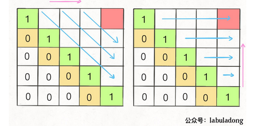

思想](#思想)

- [概念](#概念)
- [剑指10-1.斐波那契数列](#剑指10-1斐波那契数列)
- [516. 最长回文子序列 [网易]](#516-最长回文子序列-网易)

## 思想

#### 概念

- 一般形式：求最值
- 核心问题：穷举
- 构造
  - 明确 base case -> 明确「状态」-> 明确「选择」 -> 定义 dp 数组/函数的含义。

``` c++
# 初始化 base case
dp[0][0][...] = base
# 进行状态转移
for 状态1 in 状态1的所有取值：
    for 状态2 in 状态2的所有取值：
        for ...
            dp[状态1][状态2][...] = 求最值(选择1，选择2...)
```


### **一、斐波那契数列**

1. #### **暴力递归**

   ``` c++
   int fib(int N) {
       if (N == 1 || N == 2) return 1;
       return fib(N - 1) + fib(N - 2);
   }
   ```

   - **递归算法的时间复杂度？** **用子问题个数乘以解决一个子问题需要的时间。**

   首先计算子问题个数，即递归树中节点的总数。显然二叉树节点总数为指数级别，所以子问题个数为 O(2^n)。

   然后计算解决一个子问题的时间，在本算法中，没有循环，只有 `f(n - 1) + f(n - 2)` 一个加法操作，时间为 O(1)。

   所以，这个算法的时间复杂度为二者相乘，即 O(2^n)，指数级别，爆炸。

   - 存在**【重叠子问题】**

2. #### **带备忘录的递归解法**

   解决重复计算问题，若已经计算过，记录在【备忘录】中。

   遇到子问题先查备忘录

   ``` c++
   int fib(int N){
   	if(N < 1) return 0;
       //全初始化为0
   	vector<int> memo(N + 1, 0)
       return helper(memo, N);
   }
   
   int helper(vector<int> &memo, int n){
       //base case
       if(n == 1 ||n == 2) return 1;
       //已经计算过
       if(memo[n] != 0) return memo[n];
       memo[n] = helper(memo, n - 1) +hlelper(memo, n - 2);
       return memo[n];
   }
   ```

   由于本算法不存在冗余计算，子问题就是 `f(1)`, `f(2)`, `f(3)` ... `f(20)`，数量和输入规模 n = 20 成正比，所以子问题个数为 O(n)。

   解决一个子问题的时间，同上，没有什么循环，时间为 O(1)。

   所以，本算法的时间复杂度是 O(n)。比起暴力算法，是降维打击。

   

3. #### **dp数组的迭代解法** 

   将上面的【备忘录】独立出来成为一张表，【自底向上】推算。

   ``` c++
   int fib(int N){
   	if (N == 0) return 0;
       if (N == 1) return 1;
       vector<int> dp(N+1, 0);
       //base case
       dp[1] = dp[2] = 1;
       for (int i = 3; i < N; i++)
           dp[i] = dp[i - 1] + dp[i - 2];
       return dp[N];   
   }	
   ```

   #### 剑指10-1.斐波那契数列

   **【状态压缩】**进一步优化 降低空间复杂度 

   - 最经典的动态规划问题： f[n] = f[n-1] + f[n-2]  n>1
   - **通过两个状态记录即可**
   - **需要注意的是要避免越界，根据提示在计算加和的时候进行模操作**

   ```c++
   int fib(int n) {
       if (n == 2 || n == 1) 
           return 1;
       int prev = 1, curr = 1;
       for (int i = 3; i <= n; i++) {
           int sum = (prev + curr)% (1000000007);
           prev = curr;
           curr = sum;
       }
       return curr % (1000000007);
   }
   ```

## 题目汇总

### [322. 零钱兑换](https://leetcode-cn.com/problems/coin-change/)

> 计算可以凑成总金额所需的最少的硬币个数

```
输入：coins = [1, 2, 5], amount = 11
输出：3 
解释：11 = 5 + 5 + 1
```

- 符合**最优子结构**，即 11 的最少个数，是10的最少个数+1
  - base case： amount = 0，返回0
  - 状态: 目标金额
  - 选择：硬币的面值的选择
  - dp数组：dp(n) ，n为总金额，返回最少硬币个数
- 全局初始化为**amount+1**

``` C++
    int coinChange(vector<int>& coins, int amount) {
        vector<int>dp(amount+1,amount+1);
        dp[0]=0;
        //外层 状态变化 从底至上计算
        for(int i=0;i<dp.size();i++){
            //做选择 
            for (int coin:coins){
                if(i-coin<0) continue;
                dp[i]=min(dp[i],1+dp[i-coin]);
            }
        }
        //如果dp[n]等于初始值，返回-1
        return (dp[amount]==amount+1)?-1:dp[amount];
    }
```


### [300. 最长递增子序列](https://leetcode-cn.com/problems/longest-increasing-subsequence/)

> 整数数组 `nums` ，找到其中最长严格递增子序列的长度。
>
> 注意：子序列不一定是连续的
>
> ```
> 输入：nums = [10,9,2,5,3,7,101,18]
> 输出：4
> 解释：最长递增子序列是 [2,3,7,101]，因此长度为 4 。
> ```

#### **动态规划解法**

- 明确dp数组：dp[i]的含义，以nums[i]为结尾的最长递增子序列的长度

  

  

- 时间复杂度 O(N^2)  空间O(N)

``` c++
class Solution {
public:
    int lengthOfLIS(vector<int>& nums) {
        //base case:初始化为1
        vector<int> dp(nums.size(),1);

        for(int i = 0; i < nums.size(); i++){
            for(int j = 0; j < i; j++){
                if(nums[i] > nums[j]){
                    dp[i] = max(dp[i], dp[j]+1); //选择，遍历所有i之前的dp[j]
                }
            }
        }

        int res = 0;
        for(int i = 0; i < dp.size(); i++){
            res = max (res,dp[i]);
        }
        return res;
    }
};
```

【如果要求优化，时间复杂度O(N logN)】

#### 二分搜索解法【要求优化版本】

- 【耐心排序】遵循规则

  - 只能把点数小的牌压到点数比它大的牌上；如果当前牌点数较大没有可以放置的堆，则新建一个堆，把这张牌放进去；如果当前牌有多个堆可供选择，则选择最左边的那一堆放置。<u>保证牌堆顶的牌有序</u>
  - 牌的堆数就是最长递增子序列的长度
  - 牌堆顶的牌不是**有序**，处理新加牌的位置，用**二分搜索**

- 用数组来表示第i堆堆顶的牌。

  

  

```c++
int lengthOfLIS(vector<int>& nums) {
    vector<int>top(nums.size(),0);
    int piles = 0;
    for(int i = 0; i < nums.size(); i++){
        //要处理的牌
        int poker = nums[i];

        //搜索左侧边界的二分查找
        int left = 0, right = piles;
        while(left<right){
            int mid = (left + right) / 2;
            if(top[mid]>poker){
                right = mid;
            } else if(top[mid]<poker){
                left = mid + 1;
            }
            else{
                right = mid;
            }
        }

        //没有合适的牌堆，新建一个堆
        if(left == piles) piles++;
        //放到牌堆顶
        top[left] = poker;
    }
    return piles;
}
```


### [354. 俄罗斯套娃信封问题](https://leetcode-cn.com/problems/russian-doll-envelopes/)

>二维整数数组 envelopes ，其中 envelopes[i] = [wi, hi] ，表示第 i 个信封的宽度和高度。当另一个信封的宽度和高度都比这个信封大的时候，这个信封就可以放进另一个信封里。
>
>计算 **最多能有多少个** 信封能组成一组“俄罗斯套娃”信封
>
>``` 
>输入：envelopes = [[5,4],[6,4],[6,7],[2,3]]
>输出：3
>解释：最多信封的个数为 3, 组合为: [2,3] => [5,4] => [6,7]。
>```

- 类似最长递增子序列(LIS)，但考虑长宽两个变量
  - **<u>※※【关键】※※</u>**：先按宽度`w`升序排序，**如果`w`相同，则按照`h`降序排序**
    - w相同的不能互相包含，w相同将h逆序，<u>保证不出现w相同的情况。</u>
  - 把所有`h`作为一个数组计算LIS

``` c++
    int maxEnvelopes(vector<vector<int>>& envelopes) {
        int n = envelopes.size();
        if(n == 0) return 0;
        //自定义sort函数，return的内容为true排序时不交换
        sort(envelopes.begin(), envelopes.end(),[](const auto& e1, const auto& e2){
            return e1[0] < e2[0]||( e1[0] == e2[0] && e1[1] > e2[1]);
        });
        vector<int> f (n,1);
        //动态规划，求l的最长递增子序列
        for(int i = 0; i < n; i++){
            for(int j = 0; j < i; j++){
                if(envelopes[j][1] < envelopes[i][1]){
                    f[i] = max (f[i], f[j] + 1);
                }
            }
        }
        //vector中最大的元素
        return *max_element(f.begin(),f.end());
    }
```


### [53. 最大子序和](https://leetcode-cn.com/problems/maximum-subarray/)

> 找到一个具有最大和的连续子数组
>
> ```
> 输入：nums = [-2,1,-3,4,-1,2,1,-5,4]
> 输出：6
> 解释：连续子数组 [4,-1,2,1] 的和最大，为 6 。
> ```

**dp数组**

- dp[i], 以nums[i]为结尾的最大子数组和

- 分两种，自己单独/ 和相邻的最大子数组相加
  - dp[i] = max(nums[i], dp[i-1] + nums[i])

``` c++
    int maxSubArray(vector<int>& nums) {
        int n = nums.size();
        if(n == 0) return 0;
        vector<int> dp(n,0);
        //base case:
        dp[0] = nums[0];
        for(int i = 1; i < n; i++){
            dp[i] = max(nums[i], dp[i-1] + nums[i]);
        }

        return *max_element(dp.begin(),dp.end());
    }
```

**状态压缩**

- dp[i] 仅仅和 dp[i-1]的状态有关

  ``` c++
      int maxSubArray(vector<int>& nums) {
          int n = nums.size();
          if(n == 0) return 0;
          //base case:
          int dp_0 = nums[0];
          int dp_1 = 0;
          int res = dp_0;
          
          for(int i = 1; i < n; i++){
              //dp[i] = max(nums[i], dp[i-1] + nums[i]);
              dp_1 = max(nums[i], dp_0 + nums[i]);
              dp_0 = dp_1;
              res = max(dp_1, res); 
          }
          return res;   
      }
  ```

  

#### 动态规划 遍历方向

- 所需状态必须是已经计算出来的
- 遍历的终点是存储结果的位置


### [1143. 最长公共子序列](https://leetcode-cn.com/problems/longest-common-subsequence/)

```
输入：text1 = "abcde", text2 = "ace" 
输出：3  
解释：最长公共子序列是 "ace" ，它的长度为 3 。
```

- dp[i] [j]: 表示s1[0...i] 和 s2[0...j]中最长公共子序列的长度
- base case: 用索引为0的行和列表示空串
- 状态转移方程：
  - s1[i]==s2[j],dp[i] [j]=1 + dp[i-1] [j-1]
  - s1[i]≠s2[j], dp[i] [j]=max( dp[i-1] [j], dp[i] [j-1]）【lcs不包括s1[i]或s2[j]，都试一下】

``` c++
    int longestCommonSubsequence(string text1, string text2) {
        int m = text1.size(), n = text2.size();
        //初始化 base case
        vector<vector<int>> dp(m + 1, vector<int>(n + 1, 0));
        for(int i = 1; i <= m; i++){// 范围[1，m],0 用作特殊空串情况
            for(int j = 1; j <= n; j++){
                //相等时
                if(text1[i-1] == text2[j-1]){//注意这里下标
                    dp[i][j] = dp[i-1][j-1] + 1;
                }
                else{
                    dp[i][j] = max(dp[i-1][j], dp[i][j-1]);
                }
            }
        }
        return dp[m][n];
    }
```


### [72. 编辑距离](https://leetcode-cn.com/problems/edit-distance/)

> 计算出将 word1 转换成 word2 所使用的最少操作数 。
>
> 你可以对一个单词进行如下三种操作：
>
> 插入一个字符,删除一个字符,替换一个字符
>
> ``` 
> 输入：word1 = "horse", word2 = "ros"
> 输出：3
> 解释：
> horse -> rorse (将 'h' 替换为 'r')
> rorse -> rose (删除 'r')
> rose -> ros (删除 'e')
> ```

- dp数组

  - ```
    dp[i] [j]: s1[0..i] 和 s2[0..j] 的最小编辑距离
    ```

- 状态转移（三种情况）

  - ```
    if s1[i] == s2[j]:
        return dp(i - 1, j - 1)  # 啥都不做
    # 本来就相等，不需要任何操作
    ```

  - ```
    dp(i, j - 1) + 1,    # 插入
    # 直接在 s1[i] 插入一个和 s2[j] 一样的字符
    # 那么 s2[j] 就被匹配了，前移 j，继续跟 i 对比
    # 别忘了操作数加一
    ```

    ```
    dp(i - 1, j) + 1,    # 删除
    # 我直接把 s[i] 这个字符删掉
    # 前移 i，继续跟 j 对比
    # 操作数加一
    ```

    ```
    dp(i - 1, j - 1) + 1 # 替换
    # 我直接把 s1[i] 替换成 s2[j]，这样它俩就匹配了
    # 同时前移 i，j 继续对比
    # 操作数加一
    ```

- base case：dp[0] [j] = j; dp[i] [0] = i; 

- dp数组需要下标后移一位

``` c++
class Solution {
public:
    int minDistance(string word1, string word2) {
        int l1 = word1.size(), l2 = word2.size();
        vector<vector<int>> dp (l1 + 1, vector<int>(l2 + 1));
        //base case
        for(int i = 0; i <= l1; i++)//注意下标范围，0用于特殊条件
            dp[i][0] = i;
        for(int j = 0; j <= l2; j++)
            dp[0][j] = j; 

        //求解
        for(int i = 1; i <= l1; i++)
            for(int j = 1; j <= l2; j++){
                if(word1[i-1] == word2[j-1]){//注意下标
                    dp[i][j] = dp[i-1][j-1];
                }
                else{
                    dp[i][j] = Min(
                        dp[i-1][j] + 1, //插入数据
                        dp[i][j-1] + 1,//删除数据
                        dp[i-1][j-1] + 1//替换
                    );
                }
            }          
        return dp[l1][l2];
    }

    int Min(int a, int b, int c){
        return min(a,min(b,c));
    }
};
```


### 516. 最长回文子序列 [网易]

> 给定一个字符串 `s` ，找到其中最长的回文子序列，并返回该序列的长度。可以假设 `s` 的最大长度为 `1000` 。


- base case `i == j`时 `dp[i][j]=1 `

- 状态转移如下，`dp[i][j] `指i到j位最长的回文串

- **为了保证每次计算 `dp[i][j]`，左下右方向的位置已经被计算出来，反着遍历**。

  

``` 
if (s[i] == s[j])    // 它俩一定在最长回文子序列中    dp[i][j] = dp[i + 1][j - 1] + 2;else    // s[i+1..j] 和 s[i..j-1] 谁的回文子序列更长？    dp[i][j] = max(dp[i + 1][j], dp[i][j - 1]);
```

- **代码如下**

```c++
class Solution {public:    int longestPalindromeSubseq(string s) {        int len = s.size();        //全部初始化为0        vector<vector<int>>dp(len,vector<int>(len,0));        //base case        for (int i =0; i < len; i++)            dp[i][i] = 1;        //反着遍历确保正确的状态转移        for (int i = len -1; i >=0; i--)            for(int j = i+1; j < len; j++){                //状态转移方程                if(s[i] == s[j])                     dp[i][j]=dp[i+1][j-1] + 2;                 else// 左右两个哪个更长？                    dp[i][j]=max(dp[i+1][j],dp[i][j-1]);            }        return dp[0][len-1];    }};
```


### 股票买卖问题系列

**穷举框架**

- 所有状态: 第 i 天，最大交易次数K，持有状态【0或1】

``` c
dp[i][k][0 or 1]0 <= i <= n-1, 1 <= k <= Kn 为天数，⼤ K 为最多交易数此问题共 n × K × 2 种状态，全部穷举就能搞定。for 0 <= i < n:
```

- 操作（buy，sell，rest）

  

**状态转移方程**

``` c
dp[i][k][0] = max(dp[i-1][k][0], dp[i-1][k][1] + prices[i])			  max( 	选择 rest , 			选择 sell )解释：今天我没有持有股票，有两种可能：要么是我昨天就没有持有，然后今天选择 rest，所以我今天还是没有持有；要么是我昨天持有股票，但是今天我 sell 了，所以我今天没有持有股票了。dp[i][k][1] = max(dp[i-1][k][1], dp[i-1][k-1][0] - prices[i])			  max( 	选择 rest , 			选择 buy )解释：今天我持有着股票，有两种可能：要么我昨天就持有着股票，然后今天选择 rest，所以我今天还持有着股票；要么我昨天本没有持有，但今天我选择 buy，所以今天我就持有股票了。
```

**base case**

``` 
dp[-1][k][0] = 0解释：因为 i 是从 0 开始的，所以 i = -1 意味着还没有开始，这时候的利润当然是 0dp[-1][k][1] = -infinity解释：还没开始的时候，是不可能持有股票的，⽤负⽆穷表⽰这种不可能。dp[i][0][0] = 0解释：因为 k 是从 1 开始的，所以 k = 0 意味着根本不允许交易，这时候利润当然是 0dp[i][0][1] = -infinity解释：不允许交易的情况下，是不可能持有股票的，⽤负⽆穷表⽰这种不可能。
```

**总结**

```
base case：dp[-1][k][0] = dp[i][0][0] = 0dp[-1][k][1] = dp[i][0][1] = -infinity状态转移⽅程：dp[i][k][0] = max(dp[i-1][k][0], dp[i-1][k][1] + prices[i])dp[i][k][1] = max(dp[i-1][k][1], dp[i-1][k-1][0] - prices[i])
```


#### [121. 买卖股票的最佳时机](https://leetcode-cn.com/problems/best-time-to-buy-and-sell-stock/)【k=1】

> 只能选择 **某一天** 买入这只股票，并选择在 **未来的某一个不同的日子** 卖出。求最大利润
>
> ```
> 输入：[7,1,5,3,6,4]输出：5解释：在第 2 天（股票价格 = 1）的时候买入，在第 5 天（股票价格 = 6）的时候卖出，最大利润 = 6-1 = 5 。注意利润不能是 7-1 = 6, 因为卖出价格需要大于买入价格；同时，你不能在买入前卖出股票。
> ```
>
> ```
> 输入：prices = [7,6,4,3,1]输出：0解释：在这种情况下, 没有交易完成, 所以最大利润为 0。
> ```

 

状态转移方程

``` 
k 都是 1，不会改变，即 k 对状态转移已经没有影响了。可以化简去掉所有 k：dp[i][0] = max(dp[i-1][0], dp[i-1][1] + prices[i])dp[i][1] = max(dp[i-1][1], -prices[i])base case:第一天的利润 dp[0][0] = 0 dp[0][1] = -prices[0]
```

- **dp数组**

``` c++
    int maxProfit(vector<int>& prices) {
        int n = prices.size();
        vector<vector<int>>dp(n,vector<int>(2));

        for(int i = 0; i < n; i++){
            if(i == 0){
                dp[i][0] = 0;
                dp[i][1] = -prices[i];
                continue;
            }
            dp[i][0] = max(dp[i-1][0], dp[i-1][1] + prices[i]);
            dp[i][1] = max(dp[i-1][1], - prices[i]);//注意 - prices[i] 指当天做买入操作
        }
        return dp[n-1][0];//默认最后一天的状态是不持有股票
    }
```

- **进一步状态压缩**

```  c++
    int maxProfit(vector<int>& prices) {
        int n = prices.size();
        int dp_i_1,dp_i_0;

        for(int i = 0; i < n; i++){
            if(i == 0){
                dp_i_0 = 0;
                dp_i_1 = -prices[i];
               // dp[i][0] = 0;
                //dp[i][1] = -prices[i];
                continue;
            }
            //dp[i][0] = max(dp[i-1][0], dp[i-1][1] + prices[i]);
            //dp[i][1] = max(dp[i-1][1], - prices[i]);
            dp_i_0 = max(dp_i_0, dp_i_1 + prices[i]);
            dp_i_1 = max(dp_i_1, - prices[i]);
        }
        return dp_i_0;//默认最后一天的状态是不持有股票
    }
```

#### [122. 买卖股票的最佳时机 II](https://leetcode-cn.com/problems/best-time-to-buy-and-sell-stock-ii/)【多次交易 k = +infinity】

> 可以尽可能地完成更多的交易（多次买卖一支股票）
>
> 必须在再次购买前出售掉之前的股票
>
> ``` 
> 输入: prices = [7,1,5,3,6,4]
> 输出: 7
> 解释: 在第 2 天（股票价格 = 1）的时候买入，在第 3 天（股票价格 = 5）的时候卖出, 这笔交易所能获得利润 = 5-1 = 4 。
> 随后，在第 4 天（股票价格 = 3）的时候买入，在第 5 天（股票价格 = 6）的时候卖出, 这笔交易所能获得利润 = 6-3 = 3 
> ```

- **dp数组**

``` c++
    int maxProfit(vector<int>& prices) {
        int n = prices.size();
        vector<vector<int>>dp(n,vector<int>(2));

        for(int i = 0; i < n; i++){
            if(i == 0){
                dp[i][0] = 0;
                dp[i][1] = -prices[i];
                continue;
            }
            
            dp[i][0] = max(dp[i-1][0], dp[i-1][1] + prices[i]);
            dp[i][1] = max(dp[i-1][1], dp[i-1][0]- prices[i]);//注意 dp[i-1][0]- prices[i]
        }
        return dp[n-1][0];//默认最后一天的状态是不持有股票
    }
```

- **状态压缩**

``` c++
    int maxProfit(vector<int>& prices) {
        int n = prices.size();
        int dp_i_1,dp_i_0;

        for(int i = 0; i < n; i++){
            if(i == 0){
                dp_i_0 = 0;
                dp_i_1 = -prices[i];
                continue;
            }
            int temp = dp_i_0; //相当于记录dp_i-1_0
            dp_i_0 = max(dp_i_0, dp_i_1 + prices[i]);
            dp_i_1 = max(dp_i_1, temp - prices[i]);//注意 temp- prices[i]
        }
        return dp_i_0;//默认最后一天的状态是不持有股票
    }
```

#### [309. 最佳买卖股票时机含冷冻期](https://leetcode-cn.com/problems/best-time-to-buy-and-sell-stock-with-cooldown/)【k = + infinity + cooldown】

> 卖出股票后，你无法在第二天买入股票 (即冷冻期为 1 天)。

- **dp数组**

  状态转移

```c
dp[i][0] = max(dp[i-1][0], dp[i-1][1] + prices[i])
dp[i][1] = max(dp[i-1][1], dp[i-2][0] - prices[i])//注意这里的i-2
解释：第 i 天选择 buy 的时候，要从 i-2 的状态转移，⽽不是 i-1 。

对i-2，i-2 < 0 的情况特殊处理，不影响交易，此时dp[i-2][0]=0
```

``` c++
    int maxProfit(vector<int>& prices) {
        int n = prices.size();
        vector<vector<int>>dp(n,vector<int>(2));
        for(int i = 0; i < n; i++){
            if(i == 0){
                dp[i][0] = 0;
                dp[i][1] = -prices[i];
                continue;
            }
            dp[i][0] = max(dp[i-1][0], dp[i-1][1] + prices[i]);
            dp[i][1] = max(dp[i-1][1], (i<2?0:dp[i-2][0])- prices[i]);//注意
            //dp[i-2][0]- prices[i],对不存在(i-2<0)特殊处理为0
        }
        return dp[n-1][0];//默认最后一天的状态是不持有股票
    }
```

- **状态压缩**
  - 注意dp[i-2] [0]的赋值位置

``` c++
    int maxProfit(vector<int>& prices) {
        int n = prices.size();
        int dp_i_0, dp_i_1, dp_pre_2;
        int temp;
        for(int i = 0; i < n; i++){
            if(i == 0){
                dp_i_0 = 0;
                dp_i_1 = -prices[i];
                dp_pre_2 = 0;
                continue;
            }
            temp = dp_i_0;
            dp_i_0 = max(temp, dp_i_1 + prices[i]);
            dp_i_1 = max(dp_i_1, dp_pre_2 - prices[i]);//注意 dp[i-2][0]- prices[i]
            dp_pre_2 = temp;//注意，这里给dp[i-2][0]赋值
        }
        return dp_i_0;//默认最后一天的状态是不持有股票 
    }
```


#### [714. 买卖股票的最佳时机含手续费](https://leetcode-cn.com/problems/best-time-to-buy-and-sell-stock-with-transaction-fee/)【k=+infinity + fee】

> 每笔交易都需要付手续费
>
> ``` 
> 输入: prices = [1, 3, 2, 8, 4, 9], fee = 2
> 输出: 8
> 解释: 能够达到的最大利润:  
> 在此处买入 prices[0] = 1
> 在此处卖出 prices[3] = 8
> 在此处买入 prices[4] = 4
> 在此处卖出 prices[5] = 9
> 总利润: ((8 - 1) - 2) + ((9 - 4) - 2) = 8.
> ```

- **dp数组**
  - 只用在交易时减掉fee即可

``` c++
int maxProfit(vector<int>& prices, int fee) {
    int n = prices.size();
    vector<vector<int>>dp(n,vector<int>(2));
    for(int i = 0; i < n; i++){
        if(i == 0){
            dp[i][0] = 0;
            dp[i][1] = -prices[i];
            continue;
        }
        dp[i][0] = max(dp[i-1][0], dp[i-1][1] - fee + prices[i]);//注意 这里加了 - fee
        dp[i][1] = max(dp[i-1][1], dp[i-1][0]- prices[i]);
    }
    return dp[n-1][0];//默认最后一天的状态是不持有股票
}
```

- **状态压缩**

``` c++
int maxProfit(vector<int>& prices, int fee) {
    int n = prices.size();
    int dp_i_1,dp_i_0;

    for(int i = 0; i < n; i++){
        if(i == 0){
            dp_i_0 = 0;
            dp_i_1 = -prices[i];
            continue;
        }
        int temp = dp_i_0; //相当于记录dp_i-1_0
        dp_i_0 = max(dp_i_0, dp_i_1 + prices[i] - fee);//注意 -fee
        dp_i_1 = max(dp_i_1, temp - prices[i]);//注意 temp- prices[i]
    }
    return dp_i_0;//默认最后一天的状态是不持有股票
}
```

#### [123. 买卖股票的最佳时机 III](https://leetcode-cn.com/problems/best-time-to-buy-and-sell-stock-iii/)【k=2】

> 最多可以完成 **两笔** 交易。

- dp数组
  - 穷举所有可能的 k = （1，2）
  - base case: i=0时：不买入，利润为0；买入，利润为-prices[0]；

``` 
dp[i][2][0] = max(dp[i-1][2][0], dp[i-1][2][1] + prices[i])
dp[i][2][1] = max(dp[i-1][2][1], dp[i-1][1][0] - prices[i])
dp[i][1][0] = max(dp[i-1][1][0], dp[i-1][1][1] + prices[i])
dp[i][1][1] = max(dp[i-1][1][1], -prices[i])
```

``` c++
    int maxProfit(vector<int>& prices) {
        int n = prices.size();
        vector<vector<vector<int>>>dp(n,vector<vector<int>>(3,vector<int>(2)));
        
        for(int i = 0; i < n; i++){
            //base case: 不买入，0； 买入， -prices[i];
            if(i == 0){
                dp[i][1][0] = 0;
                dp[i][2][0] = 0;
                dp[i][1][1] = - prices[i]; 
                dp[i][2][1] = - prices[i];
                continue;
            }
            //要么买，要么什么都不做
            // 在买入的时候交易次数+1
            dp[i][1][0] = max(dp[i-1][1][0], dp[i-1][1][1] + prices[i]); //交易一次，卖出
            dp[i][1][1] = max(dp[i-1][1][1], -prices[i]); //没交易过，买入
            dp[i][2][0] = max(dp[i-1][2][0], dp[i-1][2][1] + prices[i]); //交易两次，卖出
            dp[i][2][1] = max(dp[i-1][2][1], dp[i-1][1][0] - prices[i]); //交易一次，买入
        }
        return dp[n-1][2][0];
    }
```

- **状态压缩**

```c++
int maxProfit(vector<int>& prices) {
    int n = prices.size();
    int dp_i10, dp_i20, dp_i11, dp_i21;
    for(int i = 0; i < n; i++){
        //base case: 不买入，0； 买入， -prices[i];
        if(i == 0){
            dp_i10 = 0;
            dp_i20 = 0;
            dp_i11 = - prices[i]; 
            dp_i21 = - prices[i];
            continue;
        }
        dp_i20 = max(dp_i20, dp_i21 + prices[i]); //交易两次，卖出
        //注意：用到dp_(i-1)10的值，放在前边
        dp_i21 = max(dp_i21, dp_i10 - prices[i]); //交易一次，买入 
        dp_i10 = max(dp_i10, dp_i11 + prices[i]); //交易一次，卖出
        dp_i11 = max(dp_i11, -prices[i]); //没交易过，买入
    }
    return dp_i20;
}
```


#### [188. 买卖股票的最佳时机 IV](https://leetcode-cn.com/problems/best-time-to-buy-and-sell-stock-iv/)【k = any Integer】

- k 的值过大可能会超内存

  - 做限制，由于一买一卖需要两天

    >  当k>n/2时，等价于无限k问题

- base case 分为 天数i=0，和交易次数j=0两种

- 考虑边界情况n=0时

``` c++
    int maxProfit(int k, vector<int>& prices) {
        int n = prices.size();
        if(n == 0) return 0; //特殊情况 n-1=-1时
        if(k > n/2) //交易次数大于天数/2时，相当于没有次数限制
            return maxProfit_k_inf(prices);
        int dp[n][k+1][2];
        for(int i = 0; i < n; i++){
            for(int j = 0; j <=k ; j++){
                // 处理base case 两种特殊情况
                //i=0,不买入，利润0；买入，利润-prices[i]
                //j=0,0次交易，利润0
                if(i == 0){ 
                    dp[i][j][0] = 0;
                    dp[i][j][1] = -prices[i];
                    continue;
                }
                if(j == 0){
                    dp[i][j][0] = 0;
                    dp[i][j][1] = 0;
                    continue;   
                }

                dp[i][j][0] = max(dp[i-1][j][0], dp[i-1][j][1] + prices[i]);
                dp[i][j][1] = max(dp[i-1][j][1], dp[i-1][j-1][0] - prices[i]);
            }
        }
        return dp[n-1][k][0];
    }

        int maxProfit_k_inf(vector<int>& prices) {
        int n = prices.size();
        int dp_i_1,dp_i_0;

        for(int i = 0; i < n; i++){
            if(i == 0){
                dp_i_0 = 0;
                dp_i_1 = -prices[i];
                continue;
            }
            int temp = dp_i_0; //相当于记录dp_i-1_0
            dp_i_0 = max(dp_i_0, dp_i_1 + prices[i]);
            dp_i_1 = max(dp_i_1, temp - prices[i]);//注意 temp- prices[i]
        }
        return dp_i_0;//默认最后一天的状态是不持有股票
    }
};
```


### [1312. 让字符串成为回文串的最少插入次数](https://leetcode-cn.com/problems/minimum-insertion-steps-to-make-a-string-palindrome/)

```
输入：s = "mbadm"
输出：2
解释：字符串可变为 "mbdadbm" 或者 "mdbabdm" 
```

- ```dp[i] [j]```：```s[i...j]```，需要```dp[i][j]```次插入变为回文串。
- base case: ```i == j```,  ```dp[i][j] =0```;【一个字符已经是回文串】
- 状态转移：
  - 如果```s[i]==s[j]```, ```dp[i][j] = dp[i+1][j-1]```
  - ```s[i]！=s[j]```，分为两种情况
    - 在位置```j```插入，使```s[i...j-1]```变为回文串 ```dp[i][j-1] +1```
    - 在位置```i```插入，使```s[i+1,...j]```变为回文串```dp[i+1][j] +1```
    - ```dp[i][j] = min(dp[i][j-1],dp[i+1][j])+1```

- 遍历方向，从下向上，从左到右

- **dp数组**

``` c++
int minInsertions(string s) {
    int n = s.size();
    vector<vector<int>> dp(n, vector<int>(n,0));//base case 全部初始化为0
    for(int i = n-2; i >= 0; i--){
        for(int j = i+1; j < n; j++){ 
            //状态变化
            if(s[i] == s[j]){
                dp[i][j] = dp[i + 1][j - 1];
            }
            else {
                dp[i][j] = min(dp[i+1][j], dp[i][j-1]) + 1;
            }      
        }
    }
    return dp[0][n-1];
}
```

- **状态压缩**
  - 投影到j的平面上，用一维表示j，用pre记录      

```c++
int minInsertions(string s) {
    int n = s.size();
    vector<int>dp(n, 0);
    int temp = 0;
    for(int i = n-2; i >= 0; i--){
        int pre = 0;//记录dp[i + 1][j - 1]
        for(int j = i+1; j < n; j++){ 
            temp = dp[j];
            //状态变化
            if(s[i] == s[j]){
                //dp[i][j] = dp[i + 1][j - 1];
                dp[j] = pre;
            }
            else {
                //dp[i][j] = min(dp[i+1][j], dp[i][j-1]) + 1;
                dp[j] = min(dp[j],dp[j-1]) + 1;
            } 
            pre = temp;     
        }
    }
    return dp[n-1];
}
```

### [10. 正则表达式匹配](https://leetcode-cn.com/problems/regular-expression-matching/)

> 给你一个字符串 s 和一个字符规律 p，请你来实现一个支持 '.' 和 '*' 的正则表达式匹配。
>
>     '.' 匹配任意单个字符
>     '*' 匹配零个或多个前面的那一个元素
>
> ```
> 输入：s = "aab" p = "c*a*b"
> 输出：true
> 解释：因为 '*' 表示零个或多个，这里 'c' 为 0 个, 'a' 被重复一次。因此可以匹配字符串 "aab"。
> ```

- **递归+备忘录**

  - base case:     

    1.p到结尾时，s是否到结尾？

     2.s到结尾，p剩下的部分可以匹配成空串？(```a*b*c*```的形式)

  - 状态转移，记录```(i,j)```用memo

    - 相等时

    ​    1.```j+1```是```'*'```，匹配0个,或```i+1```,j匹配了```i```,```j```还可以继续匹配

    ​    2.```i，j```匹配成功，```i++，j++```

    - 不相等时
      1. 下一个是*，直接跳过; 
      2. 其他，匹配失败

``` c++
class Solution {
public:
    unordered_map<string,bool>memo;
    int m, n;
    bool isMatch(string s, string p) {
         m = s.size();
         n = p.size();
        return dp(s,0,p,0);
    }
    
    bool dp(string &s, int i, string &p, int j){  
        //base case
        //1.p到结尾时，s是否到结尾？
        //2.s到结尾，p剩下的部分可以匹配成空串？(a*b*c*的形式)
        if(j == n){
            return i == m;
        }
        if(i == m){
            if((n - j) % 2 == 1){
                return false;
            }
            for(; j + 1 < n; j += 2){
                if(p[j+1] != '*')//注意是从j+1开始是*
                    return false;
            }
            return true;//注意
        }
        //状态转移，记录(i,j)用memo，消除重复计算   
        string key = to_string(i)+','+to_string(j);
        if(memo.count(key)) return memo[key];
        
        bool res = false;
        //相等时
        //1.j+1是'*'，匹配0个,或i+1,j匹配了i,j还可以继续匹配
        //2.i，j匹配成功，i++，j++
        if(s[i] == p[j] || p[j] == '.'){//有'.'直接算匹配成功
            if(j + 1 < n && p[j + 1] == '*'){
                res = dp(s, i, p, j + 2) || dp(s, i + 1, p, j);
            }
            else{
                res = dp(s,i+1,p,j+1);
            }
        }//不相等时，1. 下一个是*，直接跳过; 2. 其他，匹配失败
        else{
            if(j < n - 1 && p[j + 1] == '*'){
                res = dp(s, i, p, j+2);
            }else{
                res = false;
            }
        }
        memo[key] = res;
        return res;
    }
};
```

- **dp数组**

状态转换归纳：

    如果 p[j] == s[i] : dp[i][j] = dp[i-1][j-1]；
    如果 p[j] == '.' : dp[i][j] = dp[i-1][j-1]；
    如果 p[j] == '*'：    
        如果 p[j-1] != s[i] : dp[i][j] = dp[i][j-2] // a* counts as empty
        如果 p[j-1] == s[i] or p[j-1] == '.'：
            dp[i][j] = dp[i-1][j] // a* counts as multiple a
            or dp[i][j] = dp[i][j-1] // a* counts as single a
            or dp[i][j] = dp[i][j-2] //  a* counts as empty


```c++
 bool isMatch(string s, string p){
     	//注意 这里初始化(1)！
        s=" "+s;//防止该案例："\n" "c*"
        p=" "+p;
        int m = s.size();
        int n = p.size();
        vector<vector<int>> dp (m+1,vector<int>(n+1));
        dp[0][0] = true;//初始化(2)
        for(int i = 1; i<=m; i++){
            for(int j = 1; j <= n; j++){
                if(s[i-1] == p[j-1] || p[j-1]=='.'){
                    dp[i][j] = dp[i-1][j-1];
                }
                else if(p[j-1] == '*'){
                    if(p[j-2] != s[i-1] && p[j-2]!='.'){
                        dp[i][j] = dp[i][j-2];//去掉x*
                    }
                    else { // if(p[j-2]==s[i-1]||p[j-2]=='.')
                            dp[i][j] = dp[i-1][j]||dp[i][j-1]||dp[i][j-2];
                    }       
                }
            }
        }
        return dp[m][n];
    }
```

