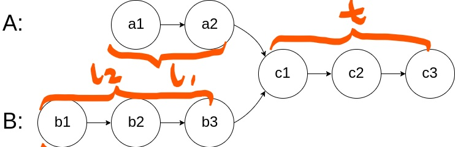

- [链表](#链表)
  - [基本信息](#基本信息)
  - [查找节点](#查找节点)
    - [2. 两数相加](#2-两数相加)
    - [剑指22. 链表中倒数第k个节点](#剑指22-链表中倒数第k个节点)
    - [141. 环形链表](#141-环形链表)
    - [142. 环形链表2 找入口节点 [Medium]](#142-环形链表2-找入口节点-medium)
    - [160. 相交链表](#160-相交链表)
    - [234. 回文链表](#234-回文链表)
    - [328. 奇偶链表](#328-奇偶链表)
  - [删除节点](#删除节点)
    - [237. 删除链表中的节点](#237-删除链表中的节点)
      - [19. 删除链表的倒数第 N 个结点](#19-删除链表的倒数第-n-个结点)
    - [83. 删除排序链表中的重复元素](#83-删除排序链表中的重复元素)
    - [82. 删除排序链表中的重复元素 II](#82-删除排序链表中的重复元素-ii)
  - [链表翻转操作](#链表翻转操作)
    - [206. 反转链表](#206-反转链表)
    - [局部反转： 反转链表前N个元素](#局部反转-反转链表前n个元素)
    - [局部反转：反转链表中第[m,n]个元素](#局部反转反转链表中第mn个元素)
    - [25. K 个一组翻转链表 [**hard]](#25-k-个一组翻转链表-hard)
  - [链表合并](#链表合并)
  - [混合操作](#混合操作)

# 链表

## 基本信息

``` c++

  Definition for singly-linked list.
  struct ListNode {
      int val;
      ListNode *next;
      ListNode() : val(0), next(nullptr) {}
      ListNode(int x) : val(x), next(nullptr) {}
      ListNode(int x, ListNode *next) : val(x), next(next) {}
  };
 
```


- 常见的包括单链表/双向链表/循环链表
- 基本都在考察对链表的**增删改查操作**
- 需要注意的点
  - **双指针法**，比如快慢指针、同向、反向指针等
  - **Dummy node**. Dummy Node 其实就是带头节点的指针
  - **临界问题**.  考虑链表是否为空， 结尾节点next指针是否有设置为nullptr; 在遍历中往往需要考虑指针是否为空。


## 查找节点

### [2. 两数相加](https://leetcode-cn.com/problems/add-two-numbers/)

> 两个 非空 的链表，表示两个非负的整数。它们每位数字都是按照 逆序 的方式存储的，并且每个节点只能存储 一位 数字。
>
> 将两个数相加，并以相同形式返回一个表示和的链表。

- ans链表的循环添加，头尾指针的初始化。  ``` head = tail = new ListNode(result);```
- 注意**额外的临界情况**。 跳出循环后，最后carry不为0时需要额外开辟空间添加最高位。


``` c++
/**
 * Definition for singly-linked list.
 * struct ListNode {
 *     int val;
 *     ListNode *next;
 *     ListNode() : val(0), next(nullptr) {}
 *     ListNode(int x) : val(x), next(nullptr) {}
 *     ListNode(int x, ListNode *next) : val(x), next(next) {}
 * };
 */
class Solution {
public:
    ListNode* addTwoNumbers(ListNode* l1, ListNode* l2) {
        
        ListNode *head = nullptr, *tail = nullptr; //初始化为空指针
     
        int carry = 0;
        while(l1 || l2){
            int i1 = l1? l1->val : 0;
            int i2 = l2? l2->val : 0;
            int result = ( i1 + i2 + carry ) % 10;
            carry = ( i1 + i2 + carry ) / 10;

        //若不存在则创建头结点，否则在链表尾部添加数字
        if(!head){
            head = tail = new ListNode(result);
        }
        else{
            tail->next = new ListNode(result);
            tail = tail->next;
        }
            if(l1) l1 = l1 -> next;
            if(l2) l2 = l2 -> next;
        }

        //若最后仍有进位，需补足最高位。
        if(carry>0){
            tail->next = new ListNode(carry);
        }
        return head;
    }
};
```


### 剑指22. 链表中倒数第k个节点

> 输入一个链表，输出该链表中倒数第k个节点。 从1开始编号

- 快慢指针法
  - 快指针走k-1位，然后快慢指针同走，直至快指针走到末尾。
  - 若k长度大于列表长度，返回时slow指针自然指向初始化的head。

``` c++
/**
 * Definition for singly-linked list.
 * struct ListNode {
 *     int val;
 *     ListNode *next;
 *     ListNode(int x) : val(x), next(NULL) {}
 * };
 */
class Solution {
public:
    ListNode* getKthFromEnd(ListNode* head, int k) {

        ListNode *fast = head;
        ListNode *slow = head;
        
        while(fast != NULL){
            fast = fast->next;//快指针走k-1位
            k--;
        
            if(k<0){//k-1位之后，慢指针开始走  判断条件k<0
                slow = slow->next;      
            }        
        }
        return slow;
    }
};
```


### 141. 环形链表

> 给定一个链表，判断链表中是否有环。

1. **记录链表指针，使用哈希表存储，检查是否出现重复**； 时间复杂度O(n)； 空间复杂度 O(n)

``` c++
class Solution {
public:
    bool hasCycle(ListNode *head) {
        unordered_set<ListNode*> seens; // 存储链表节点指针
        while(head){
            if(seens.count(head)){
                return true;
            }
            seens.insert(head);
            head=head->next;
        }
        return false;
    }
};
```


2. 快慢指针 

- 判断快指针是否出现从后追上慢指针的情况，即出现环链； 时间复杂度为O(n)，空间复杂度为O(1)

``` c++
class Solution {
public:
    bool hasCycle(ListNode *head) {
        if(head==NULL) return false;
        
        ListNode* fast = head;
        ListNode* slow = head;
        while(fast->next){
            
            if(fast->next->next){//fast->next->next不为空
                fast=fast->next->next;
                slow=slow->next;
                if(fast==slow) 
                    return true;
            }
            else{
                return false;
            }
        } 
        return false;
    }
};
```


### 142. 环形链表2 找入口节点 [Medium]

> 找到环形链表的入口节点

- 判断有环的进阶版题目
  - **在找到有环后，移动slow指针，从头重新移动，调整快慢指针速度，都设为1**
  - 当两者再次相遇时即为环的入口
  - fast - slow = k 即环长度的整数倍
  - 当前fast到入口的距离为m, 那么head到入口为k-m,
    - fast向前移动k-m到达入口(m + k -m)
    - head从头移动k-m也到达入口

``` c++
class Solution {
public:
    ListNode *detectCycle(ListNode *head) {
        ListNode* fast = head;
        ListNode* slow = head;

        if(!head) return nullptr;

        bool flag = false;
        while(fast && fast->next){     //存在环，找相遇点
            fast = fast -> next->next;
            slow = slow ->next;
            if(fast==slow){
                flag = true;
                break;
            }      
        }

        if(!flag) return nullptr;//没有环
        slow = head;
        while(slow != fast){
            fast= fast->next;
            slow = slow->next;
        }
        return slow;
    }
};
```


### [160. 相交链表](https://leetcode-cn.com/problems/intersection-of-two-linked-lists/)

找到两个单链表相交的起始节点


- **双指针法**

  - 创建两个指针 pA = headA，和 pB=headB

    - pA，pB向后逐结点遍历
    - 当 pA **到达链表的尾部时， pA = headB**；类似的，当 pB到达链表的尾部时，pB = headA
    - 若在某一时刻 pA=pB ，则为相交结点。

  - 解释：走过的长度     l1 + t + l2 = l2 + t + l1

    

- 其他一般方法及时空复杂度
  - 暴力遍历 O(mn), O(1)
  - 哈希表 O(m+n), O(m)或O(n)

``` c++
class Solution {
public: 
    ListNode *getIntersectionNode(ListNode *headA, ListNode *headB) {
        if(headA == nullptr ||headB == nullptr)
            return nullptr;
        ListNode* pA = headA;
        ListNode* pB = headB;
        while(pA != pB) {
            pA = (pA == nullptr) ?  headB : pA -> next;
            pB = (pB == nullptr) ? headA : pB -> next;
        }
        return pA;
    }
};
```

- 笨拙的方法：先计算各自的长度，然后得到长度差值，将长链表先移动差值步，之后再一起向后遍历


### [234. 回文链表](https://leetcode-cn.com/problems/palindrome-linked-list/)

> ```
> 输入: 1->2->2->1
> 输出: true
> ```

- 简单：值复制到数组中，双指针比较

  - 时间复杂度 O(N),空间 O(N)

  ``` c++
  bool isPalindrome(ListNode* head) {
      vector<int>note;
      while(head){
          note.push_back(head->val);
          head=head->next;
      }
      int len=note.size();
      int half=int(len/2);
      for (int i=0;i<half;i++)
      {
          if(note[i]!=note[len-1-i])
              return false;
      }
      return true;
  }
  ```

- **递归法** ```[容易记忆]```

  - 核心：把链表节点放入一个栈再拿出来，利用的是递归函数的堆栈
  - 时空复杂度均为O(N)

  ```c++
      ListNode* left;//从头节点开始，全局指针
      bool isPalindrome(ListNode* head) {
          left = head;
          return traverse(head);
      }
  	//利用递归倒序遍历单链表
      bool traverse(ListNode* right){
          if(right == nullptr) return true;//递归到队尾
          bool res = traverse(right->next);
  
          //后序遍历
          res = res &&(right->val == left->val);
          left = left->next;
          return res;
      }
  ```

  

- **快慢指针法**1.0

  - 找到链表中间点：使用**快慢指针**在一次遍历中找到：慢指针一次走一步，快指针一次走两步
  - 反转后半部分
  - 判断回文
  - 恢复后半部分, ```firstHalfEnd->next = reverseList(secondHalfStart);```

``` c++
class Solution {
public:
    bool isPalindrome(ListNode* head) {
        if (head == nullptr)
            return true;

        //快慢指针找到前半部分的尾结点
        ListNode* firstHalfEnd = endOfFirstHalf(head);
        //反转后半部分
        ListNode* secondHalfStart = reverseList(firstHalfEnd->next);

        //判断回文
        ListNode* p1 = head;
        ListNode* p2 = secondHalfStart;

        bool result = true;
        while(result && p2 != nullptr){//终止条件是false 或 后半部分遍历完成
            if(p1->val != p2->val){
                result = false;
            }
            p1 = p1->next;
            p2 = p2->next;
        }
        //  还原链表
        firstHalfEnd->next = reverseList(secondHalfStart);
        return result;
    }

     //快慢指针找到前半部分的尾结点
    ListNode* endOfFirstHalf(ListNode* head){
                ListNode* fast = head, *slow = head;
        while(fast->next && fast->next->next){
            slow=slow->next;
            fast=fast->next->next;
        }
        return slow;
    }

    ListNode* reverseList(ListNode* head){
        ListNode* prev = nullptr;
        ListNode* curr = head;
        while(curr != nullptr ){
            ListNode* nextTemp = curr->next;
            curr->next=prev;
            prev=curr;
            curr=nextTemp;
        }
        return prev;
    }
};
```

- **快慢指针2.0**【记这个】
  - 快慢指针找中点，同时反转慢指针经过的半区
  - 判断fast是否为null，奇数长度则将slow向前挪一位
  - 判断是否回文

``` c++
class Solution {
public:
    bool isPalindrome(ListNode* head) {
           if (head == nullptr)
            return true;
        ListNode* slow = head;
        ListNode* fast = head;
        // 快慢指针寻找中点
        ListNode* pred = nullptr;//初始化为nullptr
        ListNode* next = nullptr;
        while (fast != nullptr && fast -> next != nullptr) {
            fast = fast -> next -> next;
            // 反转慢指针遍历过的半区
            next = slow -> next;
            slow -> next = pred;
            pred = slow;
            slow = next;
        }
       
        //fast没有指向null说明为奇数，slow向前一步
        // 考虑奇数长度的情况，将slow前移
        if(fast != nullptr) {
            slow = slow -> next;
        }
        
        ListNode* left = head;
        ListNode* right = slow;
        while (left != nullptr && right != nullptr) {
            if (left -> val != right -> val) {
                return false;
            }
            left = left -> next;
            right = right -> next;
        }
        return true;
    }
};
```

### [328. 奇偶链表](https://leetcode-cn.com/problems/odd-even-linked-list/)

> 给定一个单链表，把所有的奇数节点和偶数节点分别排在一起。

```
输入: 1->2->3->4->5->NULL
输出: 1->3->5->2->4->NULL
```


- 方法：**两个指针交替取奇偶值**，然后进行头尾连接即可
  - 需要注意指针的控制: 交替取next：
    - `p1 -> next = p2 -> next` `p1 = p1 -> next`
    - `p2 -> next = p1 -> next` `p2 = p2 -> next`
- 时间复杂度 O(N) 空间复杂度 O(1)
- 关键点： **`双指针 奇指针 偶指针`**

``` c++
class Solution {
public:
    ListNode* oddEvenList(ListNode* head) {

        if(head == nullptr)
            return head;
        
        ListNode* p1 = head;
        ListNode* head2 = head->next;
        ListNode* p2 = head2;

        while(p1->next && p2->next){
            p1->next = p2->next;
            p1 = p1 -> next;
            p2->next = p1->next;
            p2 = p2->next;
        }
        p1->next = head2;
        return head;
    } 
```


## 删除节点

### [237. 删除链表中的节点](https://leetcode-cn.com/problems/delete-node-in-a-linked-list/)

> #给定的节点为非末尾节点, 且一定是链表中的一个有效节点。

``` c++
class Solution {
public:
    void deleteNode(ListNode* node) {
        node->val=node->next->val;
        node->next=node->next->next;
    }
};
```


#### [19. 删除链表的倒数第 N 个结点](https://leetcode-cn.com/problems/remove-nth-node-from-end-of-list/)

> 删除链表的倒数第 `n` 个结点，并且返回链表的头结点。

- 快慢指针，快指针比慢指针多走n-1步
- 临界情况的判断
  - 头节点为空
  - 不存在倒数第n个节点（链表长度<n）：删除头节点并返回

``` c++
class Solution {
public:
     ListNode* removeNthFromEnd(ListNode* head, int n) {
        // 临界情况
        if (!head) {
            return nullptr;
        }
        ListNode* slow = head;
        ListNode* fast = head;
        while( fast -> next != nullptr && n > 0) {
                fast = fast -> next;
                n--;
        }
        while (fast -> next != nullptr) {
            slow = slow -> next;
            fast = fast -> next;
        }
        
        //slow即为倒数第n个节点
        if (n == 0) {
            if (slow -> next != nullptr)
                slow -> next = slow -> next -> next;   //slow->next 存在
        }
        // 临界情况，需要删除头节点
        else {
            head = head -> next;
        }
        return head;
    }
```

### [83. 删除排序链表中的重复元素](https://leetcode-cn.com/problems/remove-duplicates-from-sorted-list/)

> 按升序排列的链表，删除所有重复的元素，使每个元素 **只出现一次** 。

- 双指针，比较相邻两个是否相等

``` C++
class Solution {
public:
    ListNode* deleteDuplicates(ListNode* head) {

        if(head == nullptr) return head;

        ListNode* cur = head;
        ListNode* rear = head->next;

        while(cur && rear){
            //如果有重复，删除rear，rear向后移一位
            if(cur->val == rear->val){
                cur->next=rear->next;
                rear = rear->next;
            }
            //无重复，都向后移一位
            else{
                    rear=rear->next;
                    cur=cur->next;
            }
        }
        return head;

    }
};
```


### [82. 删除排序链表中的重复元素 II](https://leetcode-cn.com/problems/remove-duplicates-from-sorted-list-ii/)

> 删除链表中所有存在数字重复情况的节点，只保留原始链表中 **没有重复出现** 的数字。
>
> ```
> 输入：head = [1,2,3,3,4,4,5]
> 输出：[1,2,5]
> ```

- dummy节点 
  - 设置dummy节点，**避免head节点也被删除的特殊情况处理** phead -> next = head；
- 判断重复值，跳过重复段
  - 当未重复时 `prev -> next == cur`，正常向后移动prev
  - 当出现重复时 `prev -> next != cur`，**调整prev指针next方向**
- 注意返回值：``` phead->next```

``` c++
   ListNode* deleteDuplicates(ListNode* head) {

        if(head == nullptr) return head;
        
        ListNode* phead = new ListNode();
        phead->next = head;
        ListNode* cur = head;
        ListNode* prev = phead;
        //ListNode* rear = head->next;

        while(cur){

            //定位到重复段末尾
            while(cur->next && cur->val == cur->next->val){
                cur = cur->next;
            }

            //若无重复段，正常向后移动一位
            if(prev -> next == cur){
                prev = prev ->next;
            }
            //有重复段，接末尾的next
            else{
                prev->next = cur->next;
            }
            cur = cur -> next;
        }
        return phead->next; //注意返回值
    }
```


## 链表翻转操作

### [206. 反转链表](https://leetcode-cn.com/problems/reverse-linked-list/)

> 输入一个链表的头节点，反转该链表并输出反转后链表的头节点。

```
输入: 1->2->3->4->5->NULL
输出: 5->4->3->2->1->NULL
```

- 一次遍历，双指针 `prev` `cur`
  - 记录前一个节点，修改当前节点的指针为前一个节点，完成翻转
  - 返回最后一个节点的指针
  - 时间复杂度O(N),空间复杂度O(1)

- 关键点：**` 一次遍历+双指针 `  `递归解法`**

1. 一次遍历+双指针 

``` c++
ListNode* reverseList(ListNode* head) {
    
    if(head==NULL||head->next==NULL) return head;//仅有一个元素或空
    
    ListNode* cur = head;
    ListNode* prev = NULL;

    while(cur){
        ListNode*next = cur ->next;
        cur->next =prev;
        prev = cur;
        cur = next;
    }

    return prev;
}
```


2. **递归反转链表**

   

``` c++
ListNode* reverseList(ListNode* head) {    
	if(head==NULL||head->next==NULL) return head;

    ListNode *p = reverseList(head->next);//递归head->next
    head->next->next=head;
    head->next=NULL;
    return p;//返回p
}
```


### 局部反转： 反转链表前N个元素


- `reverseN(head, 3)` 给定头指针，反转前3个元素，返回头指针

  ；

  - 仍然将问题简化为两步： 给定head，对于head->next后的N-1个元素，通过reverseN(head->next,N-1);
  - 完成反转后，将head和head->next进行反转，并**将head的next指向原来链表中的第N+1个元素**
  - 这个N+1元素需要在递归中提前记录，并将其作为递归终止的条件。

``` c++
	//记录后驱节点successor   
	ListNode* successor  = NULL;

    ListNode* reverseHead(ListNode* head, int n){//反转从head开始之后n个链表
       //basecase为n==1
        if(n == 1){
            successor = head->next;
            return head;
        }
        ListNode* p =reverseHead(head->next, n-1);//注意n-1
        head->next->next=head;
        head->next=successor;
        return p;
    }
```


### 局部反转：反转链表中第[m,n]个元素

可以把问题进行简化，当**指针遍历到需要开始翻转的位置时**调用前面的reverseN即可：

- head->next=reverse(head->next,m-1,n-1): 直观看就是在链表遍历，m-1和n-1即保证反转的相对位置不变；
- 对于reverse中m==1 表明已经到达待翻转位置：

``` c++
class Solution {
public:
    ListNode* successor  = NULL;
    ListNode* reverseHead(ListNode* head, int n){//反转从head开始之后n个链表
        //base case
        if(n == 1){
            successor = head->next;
            return head;
        }
        ListNode* p =reverseHead(head->next, n-1);
        head->next->next=head;
        head->next=successor;
        return p;
    }


    ListNode* reverseBetween(ListNode* head, int left, int right) {
        if(left==1){
            return reverseHead(head,right);
        }
        //前进到反转的起点 触发base case
        head->next = reverseBetween(head->next,left - 1, right -1);// right-1保证反转的相对位置不变
        return head;
    }
};
```


### [25. K 个一组翻转链表](https://leetcode-cn.com/problems/reverse-nodes-in-k-group/) [**hard]

> 每 k 个节点一组进行翻转，请你返回翻转后的链表

```
输入：head = [1,2,3,4,5], k = 2
输出：[2,1,4,3,5]
```

- 递归做法
- head指针指向每组的第一个，反转head开头的k个元素
- 第k+1个元素作为head，继续反转
- pre记录上一组的末尾，和翻转后的头相连
  - **dummy head，避免特殊判断**
- base case：最后的元素不足k个，就保持不变

- 一次遍历，时间复杂度O(N),空间复杂度O(1)

``` C++
class Solution {
public:

    //反转区间[a,b)的元素  【左闭右开】
    ListNode* reverse(ListNode* a,ListNode* b){
        ListNode *pre, *cur, *nxt;
        pre = nullptr;
        cur = a;
        nxt = a;

        while(cur != b){//判断不等于尾巴
            nxt = cur->next;
            cur -> next = pre;
            pre = cur;
            cur = nxt;
        }
        return pre;
    }

    ListNode* reverseKGroup(ListNode* head, int k) {
        if (!head) 
        return head;

        ListNode* a = head;
        ListNode* b = head;  
        for(int i = 0; i < k; i++){
            //base case：不足k个不需要反转
            if (b == nullptr) return head;
            b = b -> next;
        }
        ListNode* newHead = reverse(a, b);
        // 连接后续链表,从下一组头部继续递归反转
        a-> next = reverseKGroup(b,k);
        return newHead;
    }
};
```


## 链表合并

## 混合操作

